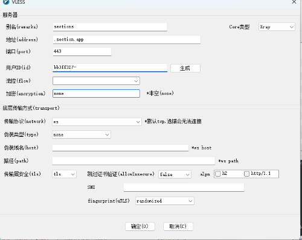

# sectionio-action

## 在 section.io 上，随便创建任何应用后

## 在应用的设置界面，找到应用的 Kubernetes API Endpoint

## 在 API Tokens 创建一个 SECTION_API_TOKEN

## 创建如下的 GitHub Secrets

<!-- 创建一个三行两列的 markdown table -->

| Name | Value |
| ---- | ----- |
| SECTION_API_TOKEN | xxxxxxxx-xxxx-xxxx-xxxx-xxxxxxxxxxxx |
| SECTION_K8S_API_URL | https://****.kube.api.section.io/ |
| UUID | cbf1fca7-fa54-446e-88f1-68cb9a1ed5a6 |

Example:

## 使用 action 手动 或 定期部署项目（每2天一次）

手动点击 Actions，选择 Deploy to section，然后部署。

默认配置是 ws 配置。

### 如果你愿意，你也可以在修改 [Dockerfile](./Dockerfile).

### 如果你愿意，你也可以在 [config](./k8s/config.yaml), 修改任何关于server的配置。
